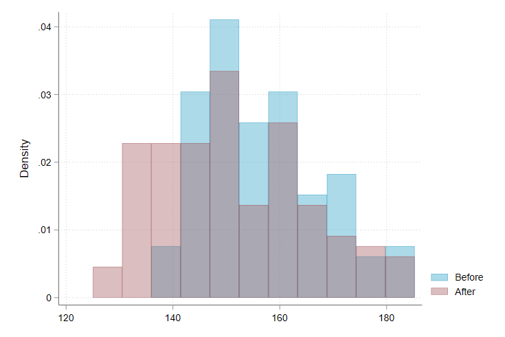

multihistogram
=================================

[Overview](#overview)
| [Prerequisites](#prerequisites)
| [Installation](#installation)
| [Usage](#usage)
| [Todo](#todo)
| [License](#license)

Neatly aligned overlaid histograms in Stata

`version 0.9 27oct2021`


Overview
---------------------------------

multihistogram allows Stata users to easily construct overlaid histograms with aligned bins in Stata.

Default Stata allows users to construct overlaid histograms using the -twoway- graph command. However, when multiple histogram graph types are specified, bins are constructed separately for each series:
```stata
sysuse bpwide
twoway (histogram bp_before, color(ebblue%40)) (histogram bp_after, color(maroon%40))
```

Yielding a graph that looks like:


With multihistogram, we can align the bins in a single line:
```stata
multihistogram bp_before bp_after
```

Yielding a graph that looks like:


Which is equivalent (with two variables) to the following Stata code:
```stata
sum bp_before
local min1 = r(min)
local max1 = r(max)
local n1 = r(N)
sum bp_after
local min2 = r(min)
local max2 = r(max)
local n2 = r(N)
local min = min(`min1`,`min2')
local max = max(`max1`,`max2')
local n = min(`n1',`n2')
bins = min(sqrt(`n'),10*ln(`n')/ln(10))
width = (`max'-`min')/`bins'
twoway (histogram bp_before, start(`min') width(`width') color(ebblue%40)) (histogram bp_after, start(`min') width(`width') color(maroon%40))
```

Prequisites
---------------------------------

multhistogram requires Stata 14 or higher, since color opacities are used by default. Overlaid histograms generally look pretty terrible otherwise.


Installation
---------------------------------

You can install multihistogram (or upgrade from a previous release) with the following command:
```stata
net install multihistogram, from(https://raw.githubusercontent.com/mdroste/stata-multihistogram/main/) replace
```

Usage
---------------------------------

Basic usage of multihistogram is simply to type multihistogram followed by a varlist of up to 4 variables.
```stata
sysuse bpwide
multihistogram bp_before bp_after
```

You can specify twoway graph options by including them in the optional argument twopt(). For instance, to specify legend titles:
```stata
multihistogram bp_before bp_after, twopt(legend(order 1 "Before" 2 "After")))
```

multihistogram allows global 'if'/'in' expressions to be applied to the data before processing in the usual way. One can also specify ifs for each series separately with if1(), if2(), if3(), if4(), which may be useful if you have one series that you want to produce overlaid histograms for depending on conditional ifs (i.e. long data).

Opacity of the histogram can be controlled with the optional opacity() argument. The default is 40 percent opacity, opacity(40).

To-do
---------------------------------

This program is incomplete (though perhaps still useful).

[] - Write an internal help-file
[] - Color selection (I like my defaults though)
[] - Ability to pass in twoway, histogram options for individual series (i.e. turn off outlines)

License
---------------------------------

multihistogram is [MIT-licensed](https://github.com/mdroste/stata-multihistogram/blob/master/LICENSE).
